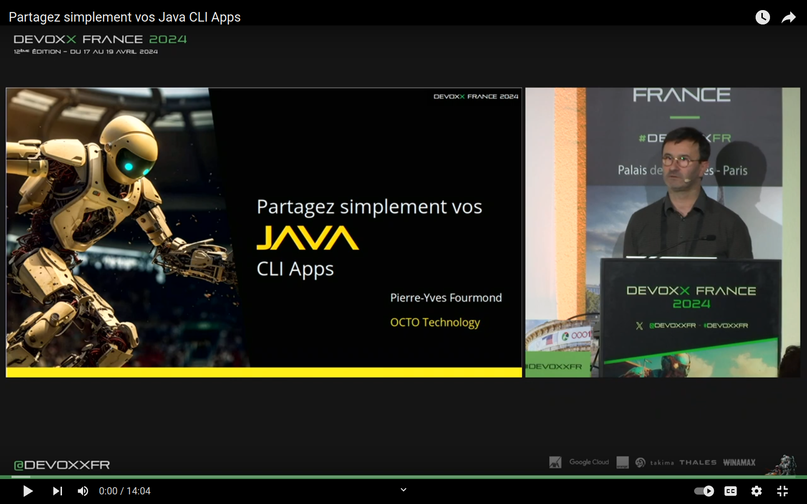
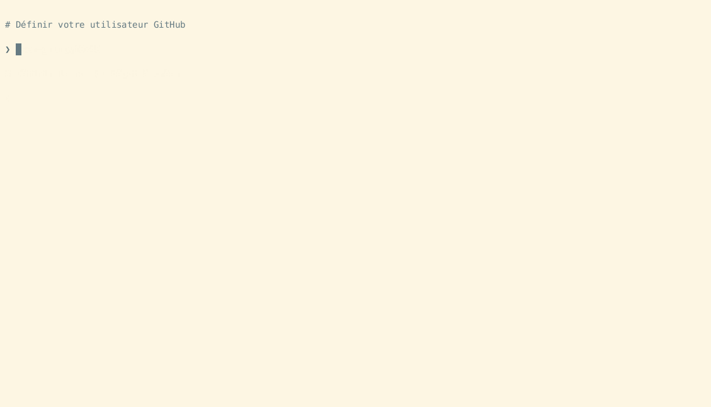
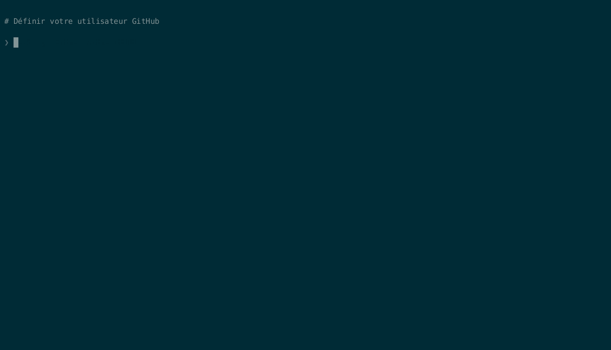

# :floppy_disk: Partagez simplement vos Java CLI Apps

L'organisation [Java CLI Apps](https://github.com/java-cli-apps) héberge les slides, programmes d'exemple et templates d'application de mon talk [« :floppy_disk: Partagez simplement vos Java CLI Apps »](https://youtu.be/Disp1KJDKzA).

Ce talk présenté le 9 janvier 2024 lors de la 11ème édition de [Paris JUG Academy](https://parisjug.org/events/2024/01-09-young-blood-11/) en a été le [gagnant](https://twitter.com/parisjug/status/1745210477615985117).

Il a aussi été présenté à :

* [Devoxx France](https://mobile.devoxx.com/events/devoxxfr2024/schedule) le [17 avril 2024](https://mobile.devoxx.com/events/devoxxfr2024/talks/36021/details)
* [Human Talks Paris](https://meetup.com/fr-FR/humantalks-paris/events/306459030/) le 11 mars 2025
* [Oracle Dev Days](https://www.oracle.com/fr/developer/events/dev-tour/#java) le 22 mai 2025

# Sommaire :

<!-- TOC -->
* [Présentations](#présentations)
  * [Paris JUG Academy](#paris-jug-academy)
  * [Devoxx France](#devoxx-france)
  * [Human Talks Paris](#human-talks-paris)
  * [Oracle Dev Days](#oracle-dev-days)
* [Templates d'applications](#templates-dapplications)
  * [Templates Java 23](#templates-java-23)
  * [Templates Java 22](#templates-java-22)
  * [Template Java 11](#template-java-11)
* [Exemples de code](#exemples-de-code)
  * [Exemple d'utilisation de la JEP 458](#exemple-dutilisation-de-la-jep-458)
  * [Exemple du talk](#exemple-du-talk)
  * [Exemple du talk avec Java 22](#exemple-du-talk-avec-java-22)
* [Liens et ressources](#liens-et-ressources)
* [Contact](#contact)
<!-- TOC -->

## Présentations

### Paris JUG Academy

#### [Vidéo](https://youtu.be/Disp1KJDKzA)

### Devoxx France

#### Vidéo

#### 

#### [Slides](https://java-cli-apps.github.io/slides/devoxx_france/Partagez_simplement_vos_Java_CLI_Apps.pdf)

### Human Talks Paris

#### [Slides](https://java-cli-apps.github.io/slides/human_talks/Partagez_simplement_vos_Java_CLI_Apps.pdf)

### Oracle Dev Days

#### [Vidéo](https://www.youtube.com/watch?v=R9ONCJ6mQkA&list=PLg4b0rSMICPtcfg6G8iAxHPE0ZDf1tzuM)

#### [Slides](https://java-cli-apps.github.io/slides/oracle_dev_days/Partagez_simplement_vos_Java_CLI_Apps.pdf)

## Templates d'applications

Ces templates GitHub servent de base à la création d'une application comme expliqué dans le talk.

Deux templates sont fournis pour Java 23, l'un fonctionne avec `make` et l'autre utilise `Gradle`.  Il en est de même pour Java 22.

De plus un dernier template existe pour les releases antérieures à Java 22, et qui utilise `make`.

### Templates Java 23

Les templates [basic-java-23-quickstart](https://github.com/java-cli-apps/basic-java-23-quickstart) et [java-23-quickstart](https://github.com/java-cli-apps/java-23-quickstart) nécessitent d'utiliser Java 23 ou une version supérieure car ils utilisent la [JEP 477](https://openjdk.org/jeps/477) qui simplifie la déclaration de la méthode `main`, ne nécessite pas de déclaration de classe et permet d'utiliser les méthodes de la classe `java.io.IO` sans aucun import.

Ils utilisent également la [JEP 458](https://openjdk.org/jeps/458) qui permet de lancer plusieurs fichiers sources sans les compiler préalablement.

#### Avec Java 23 et make

#### Avec Java 23 et Gradle

### Templates Java 22

Ces templates nécessitent d'utiliser Java 22 ou une version supérieure car ils utilisent la [JEP 458](https://openjdk.org/jeps/458) qui permet de lancer plusieurs fichiers sources sans les compiler préalablement.

#### Avec Java 22 et make

Le template [basic-java-22-quickstart](https://github.com/java-cli-apps/basic-java-22-quickstart) permet de démarrer une nouvelle commande ligne avec Java 22 sans utiliser aucun système de build (autre que `make`).

#### Avec Java 22 et Gradle

Le template [java-22-quickstart](https://github.com/java-cli-apps/java-22-quickstart) permet de démarrer une nouvelle commande ligne avec Java 22 et Gradle.

### Template Java 11

Le template [basic-java-11-quickstart](https://github.com/java-cli-apps/basic-java-11-quickstart) permet de démarrer une nouvelle commande ligne en Java sans utiliser aucun système de build (autre que `make`).

Ce template nécessite d'utiliser Java 11 ou une version supérieure car il utilise la [JEP 330](https://openjdk.org/jeps/330) qui permet de lancer un fichier source sans le compiler préalablement.

**Note:** Ce dépôt est maintenant archivé et ne sera plus mis à jour.

## Exemples de code

### Exemple d'utilisation de la JEP 458

Un exemple basique d'utilisation de [la JEP 458](https://github.com/java-cli-apps/java-cli-apps.github.io/blob/main/exemples/jep-458/README.md) (Launch Multi-File Source-Code Programs) qui étend la [JEP 330](https://openjdk.org/jeps/330) (Launch Single-File Source-Code Programs) et permet de charger les classes utilisées par la classe lancée sur la ligne de commande.

### Exemple du talk

L'exemple de code du talk qui utilise [Java 21](https://github.com/java-cli-apps/java-cli-apps.github.io/blob/main/exemples/generate-data-21/README.md) et dans lequel tout le code source se trouve dans le même fichier.

### Exemple du talk avec Java 22

Le même exemple, mais utilisant [Java 22](https://github.com/java-cli-apps/java-cli-apps.github.io/blob/main/exemples/generate-data-22/README.md) pour déclarer chaque classe dans un fichier séparé grâce à la [JEP 458](https://openjdk.org/jeps/458).

## Liens et ressources

### JDK, Doc

[dev.java: The Destination for Java Developers](https://dev.java)

[jdk.java.net: Production and Early-Access OpenJDK Builds, from Oracle](https://jdk.java.net)

[docs.oracle.com: The java Command](https://docs.oracle.com/en/java/javase/24/docs/specs/man/java.html)

[docs.oracle.com: The Java Virtual Machine Instruction Set](https://docs.oracle.com/javase/specs/jvms/se7/html/jvms-6.html)

### Sur la JEP 330

[JEP 330: Launch Single-File Source-Code Programs](https://openjdk.org/jeps/330)

[JEP 458: Launch Multi-File Source-Code Programs](https://openjdk.org/jeps/458)

[Inside Java Newscast #63: Does Java 22 Kill Build Tools ?](https://inside.java/2024/02/15/newscast-63)

[JDK Source Code: Handling Shebang](https://github.com/openjdk/jdk/blob/master/src/jdk.compiler/share/classes/com/sun/tools/javac/launcher/ProgramFileObject.java#L70)

[The Go Cookbook: Running a file via a shebang line](https://golangcookbook.com/chapters/running/shebang)

### JEPs qui simplifient Java

[JEP 494: Module Import Declarations (Second Preview)](https://openjdk.org/jeps/494)

[JEP 495: Simple Source Files and Instance Main Methods (Fourth Preview)](https://openjdk.org/jeps/495)

### Outils, Articles, Sites

[The Java Version Almanac](https://javaalmanac.io)

[SDKMAN: The Software Development Kit Manager](https://sdkman.io)

[JBang: Use Java for scripting](https://www.jbang.dev)

[Démarrer vos projets Java plus rapidement avec JBang](https://grumpyf0x48.org/demarrer-vos-projets-java-plus-rapidement-avec-jbang)

### Librairies

[RecordArgs: A simple command-line argument parser for Java applications](https://github.com/nipafx/record-args)

## Contact

🦋 [pyfourmond.bsky.social](https://bsky.app/profile/pyfourmond.bsky.social)

 https://linkedin.com/in/pyfourmond