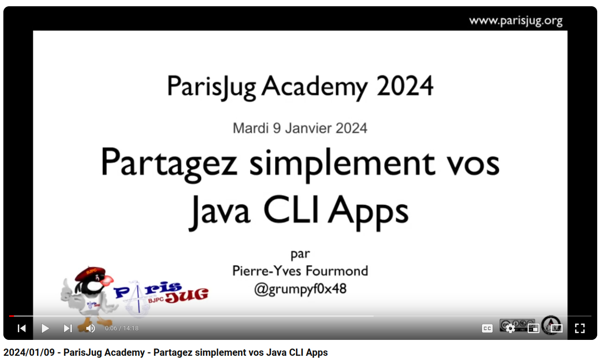

# :floppy_disk: Partagez simplement vos Java CLI Apps

L'organisation [Java CLI Apps](https://github.com/java-cli-apps) héberge les slides, programmes d'exemple et templates
d'application de mon talk [« :floppy_disk: Partagez simplement vos Java CLI Apps »](https://youtu.be/Disp1KJDKzA?si=_Owz6_UxddetUzCT).

Ce talk a été le [gagnant](https://twitter.com/parisjug/status/1745210477615985117) de la
[Paris JUG Academy](https://www.parisjug.org/events/2024/01-09-young-blood-11/) 2024.

Il a également été présenté à [Devoxx France](https://mobile.devoxx.com/events/devoxxfr2024/schedule) le
[17 Avril](https://mobile.devoxx.com/events/devoxxfr2024/talks/36021/details) dernier.

<!-- TOC -->
  * [Paris JUG Academy](#paris-jug-academy)
  * [Devoxx France](#devoxx-france)
  * [Exemples de code](#exemples-de-code)
  * [Templates d'applications](#templates-dapplications)
<!-- TOC -->

## Paris JUG Academy

### 

## Devoxx France

### [Slides](https://java-cli-apps.github.io)

### Vidéo - A VENIR

## Exemples de code

### Exemple du talk

L'exemple de code du talk qui utilise [Java 21](https://github.com/java-cli-apps/java-cli-apps.github.io/blob/main/exemples/generate-data-21/README.md)
et dans lequel tout le code source se trouve dans le même fichier.

### Exemple du talk avec Java 22

Le même exemple avec [Java 22](https://github.com/java-cli-apps/java-cli-apps.github.io/blob/main/exemples/generate-data-22/README.md)
qui permet de déclarer chaque classe dans un fichier séparé grâce à la [JEP 458](https://openjdk.org/jeps/458).

### Exemple d'utilisation de la JEP 458

Un exemple basique d'utilisation de [la JEP 458](https://github.com/java-cli-apps/java-cli-apps.github.io/blob/main/exemples/jep-458/README.md)
(Launch Multi-File Source-Code Programs) qui étend la [JEP 330](https://openjdk.org/jeps/330) (Launch Single-File Source-Code Programs)
et permet de charger les classes utilisées par la classe lancée sur la ligne de commande.

## Templates d'applications

Ces templates GitHub sont des dépots qui peuvent servir de base à la création d'une application comme expliqué dans le talk.

Deux templates principaux sont fournis pour Java 22, un utilisant `make` et l'autre utilisant `Gradle`.

De plus un troisième template existe pour les releases antérieures à Java 22.

### Templates Java 22

Ces templates nécessitent d'utiliser Java 22, ou une version supérieure, car ils utilisent la [JEP 458](https://openjdk.org/jeps/458)
qui permet de lancer plusieurs fichiers sources sans les compiler préalablement.

#### Avec Java 22 et make

Le template [basic-java-22-quickstart](https://github.com/java-cli-apps/basic-java-22-quickstart) permet de démarrer
une nouvelle application en commande ligne avec Java sans utiliser aucun système de build (autre que `make`).

#### Avec Java 22 et Gradle

Le template [java-22-quickstart](https://github.com/java-cli-apps/java-22-quickstart) permet de démarrer une nouvelle
application en commande ligne avec Java et Gradle.

### Template Java 11

Le template [basic-java-quickstart](https://github.com/java-cli-apps/basic-java-quickstart) permet de démarrer une
nouvelle application en commande ligne avec Java sans utiliser aucun système de build (autre que `make`).

Ce template nécessite d'utiliser Java 11, ou une version supérieure, car il utilise la [JEP 330](https://openjdk.org/jeps/330)
qui permet de lancer un fichier source sans le compiler préalablement.
